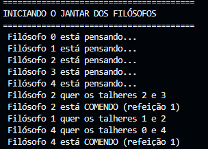

# Relatório: O Problema do Jantar dos Filósofos
## 1. Contexto inicial do trabalho
Este trabalho foi desenvolvido como parte da disciplina de Sistemas Operacionais (Semestre 2025.2). O objetivo é implementar uma solução para o clássico Problema do Jantar dos Filósofos, abordando conceitos fundamentais de concorrência, sincronização de threads e prevenção de deadlock. O problema ilustra as dificuldades enfrentadas por processos concorrentes que compartilham recursos limitados.

## 2. Descrevendo a solução em Python para o jantar dos filósofos
A solução utiliza a linguagem Python e a biblioteca threading. Cada filósofo é representado por uma thread independente e cada talher é um objeto do tipo Lock. Os filósofos alternam entre os estados de pensar e comer. Como os talheres são recursos compartilhados, aplicamos exclusão mútua através de Locks para garantir que dois vizinhos não comam simultaneamente.

## 3. Implementando o algoritmo
O algoritmo funciona criando uma lista global de talheres (Locks). Ao instanciar cada filósofo (Thread), passamos os índices dos talheres à sua esquerda e direita. O fluxo de execução segue um loop onde o filósofo pensa, solicita os recursos em uma ordem específica para evitar conflitos, come por um período determinado e, por fim, libera os recursos para os vizinhos.

## 3.1 Qual o algoritmo utilizado
Foi utilizada a estratégia de Prevenção de Deadlock por Ordenação de Recursos (Hierarquia). Nessa abordagem, quebramos a simetria da mesa: cada filósofo sempre tenta adquirir primeiro o talher que possui o menor índice numérico na lista global, e apenas depois tenta o de maior índice. Isso elimina a condição de espera circular.

## 3.2 Implementação do algoritmo em Python
A implementação utiliza Programação Orientada a Objetos, onde cada filósofo é uma instância da classe Filosofo, herdando de threading.Thread. O comportamento principal é definido no método run():

    class Filosofo(threading.Thread):
        def __init__(self, id, talher_esq, talher_dir):
            super().__init__()
            self.id = id
            self.talher_esq = talher_esq
            self.talher_dir = talher_dir

        def run(self):
            while True:
                self.pensar()
                
                # Lógica de ordenação de recursos dentro da classe
                primeiro = min(self.talher_esq, self.talher_dir)
                segundo = max(self.talher_esq, self.talher_dir)

                with lista_talheres[primeiro]:
                    with lista_talheres[segundo]:
                        self.comer()
## 4. Tratando impasse
## 4.1 Qual a estratégia de tratamento de impasses
A estratégia adotada foi a Prevenção, atacando especificamente a condição de "Espera Circular". Em um sistema sem essa prevenção, se todos os filósofos pegassem o talher da esquerda simultaneamente, o sistema entraria em deadlock. Com a ordenação, o último filósofo inverte a ordem de busca, quebrando o ciclo.

## 4.2 Implementação do tratamento de impasse em Python
O tratamento é feito diretamente no fluxo de execução da thread. Ao utilizar a lista global de locks (lista_talheres), a classe garante que a disputa pelo recurso seja centralizada e ordenada:

    primeiro = min(self.talher_esq, self.talher_dir)
    segundo = max(self.talher_esq, self.talher_dir)

    with lista_talheres[primeiro]:
        with lista_talheres[segundo]:
            self.comer()
## 5. Executar o código e descrever comportamento observado
Ao executar o código, observou-se que os filósofos alternam entre pensar e comer sem interrupções permanentes. O log no console mostra que filósofos não vizinhos conseguem comer ao mesmo tempo, enquanto vizinhos aguardam a liberação do recurso. O programa encerra com sucesso após todos os filósofos completarem suas refeições, sem nunca atingir um estado de travamento.

## 6. Considerações finais
A atividade permitiu compreender de forma prática o funcionamento de processos concorrentes. O uso de mecanismos de sincronização, como os Locks, mostrou-se imprescindível para garantir a exclusão mútua. A implementação da hierarquia de recursos foi uma solução eficaz para evitar condições de corrida e assegurar que todos os filósofos pudessem comer, demonstrando a importância do design de algoritmos em sistemas multithread.